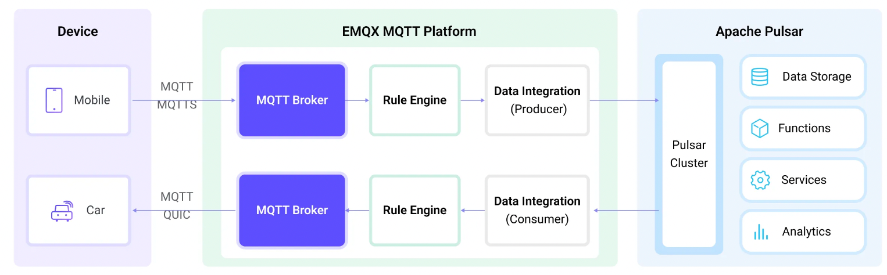

# mqtt-to-pulsar

Streaming IoT data into Apache Pulsar using MQTT and EMQX | MQTT Pulsar Integration

## Introduction

This tutorial will show you how to use EMQX to ingest data into Pulsar. We will use the [EMQX](https://www.emqx.io/) MQTT broker to publish to messages and [Apache Pulsar](https://pulsar.apache.org/) to store the data.

Using EMQX's Webhook integration can bring the following advantages to your business:

- **Partition Selection Capability**: Pulsar provides different partitioning strategies to write messages from the same MQTT client, topic, or user into the same partition, facilitating subsequent data tracking and processing. 
- **High Efficiency with Batch Processing**: TWhen batch mode is enabled, EMQX can write multiple pieces of data into Pulsar at the same time. With batch mode enabled, EMQX will temporarily store each piece of data and then write the entire batch of temporarily stored data into Pulsar after a certain amount of time has passed or after a certain number of data pieces have accumulated. This significantly improves write efficiency.
- **MQTT Message Conversion**: The EMQX rule engine allows users to filter and process MQTT messages from the device side, reducing data redundancy and simplifying processing.
- **Higher Throughput and Low Latency**: Pulsar is a distributed messaging system designed to achieve high throughput and low latency, making it highly practical for real-time data processing and analysis scenarios. 

## Architecture



| Name      | Version | Description                                                                      |
| --------- | ------- | -------------------------------------------------------------------------------- |
| [EMQX Enterprise](https://www.emqx.com/en/products/emqx)      | 5.7.0+  | MQTT broker used for message exchange between MQTT clients and the Pulsar. |
| [MQTTX CLI](https://mqttx.app/cli) | 1.9.3+  | Command-line tool used to generate simulated data for testing.        |
| [Pulsar](https://pulsar.apache.org/)     | 2.11.0+  | A cloud-native, distributed messaging and streaming platform.          |

## How to use

1. Please make sure you have installed the [docker](https://www.docker.com/), and then running the following commands to start the demo:

  ```bash
  docker-compose up -d
  ```

2. Running the following commands to send the message using MQTTX:

  ```bash
  mqttx pub -h 127.0.0.1  -t "t/1" -q 2 -m "hello"
  ```

## License

[Apache License 2.0](./LICENSE)